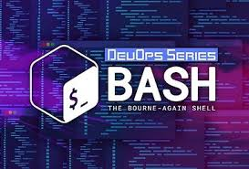
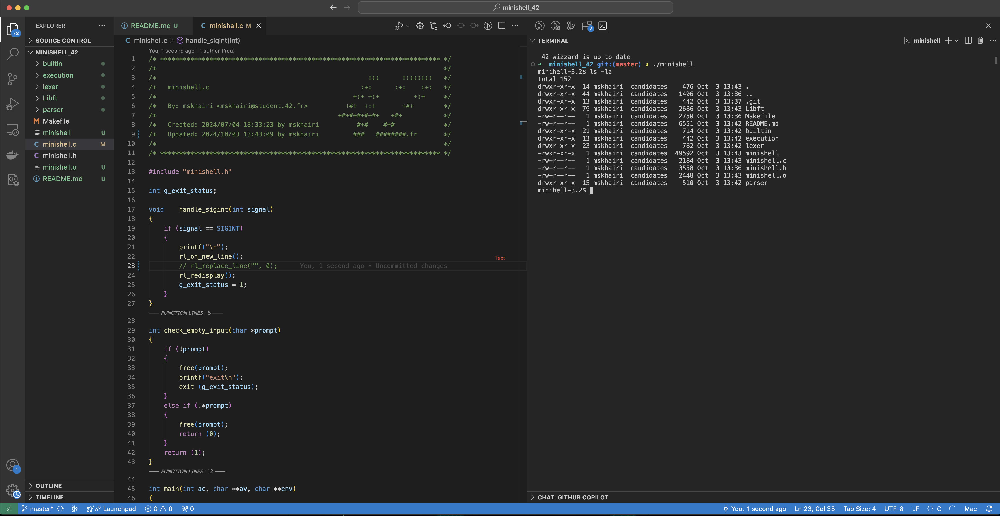
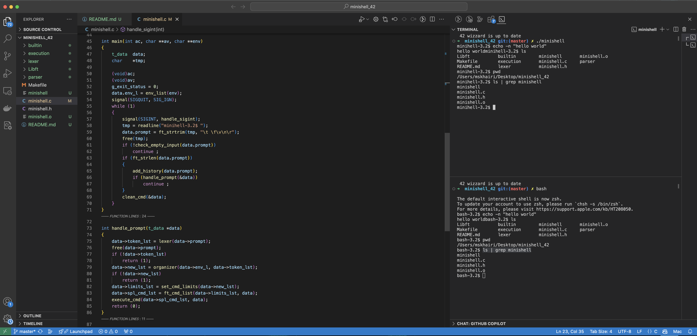

# Minishell 42 Project

  

## Project Overview

The <strong>Minishell 42</strong> project is an introduction to writing a simple Unix shell in C, emulating key features of common shell environments. The goal of the project is to enhance understanding of process management, file descriptors, and Unix system calls, while giving students a deeper insight into how command-line interpreters operate. This project offers a hands-on experience in building a functioning shell capable of executing commands, handling pipes, redirections, and more. By completing this project, you will gain experience with important concepts such as signal handling, environment variables, and memory management in a low-level language like C.

## Features

<ul>
  <li>Basic command execution: Executes user commands just like in any common Unix shell (e.g., <code>ls</code>, <code>echo</code>, <code>cat</code>, etc.).</li>
  <li>Environment variable management: Handles environment variables, allows exporting, and recognizes <code>$</code> to substitute variables within commands.</li>
  <li>Command piping: Supports piping (e.g., <code>command1 | command2</code>) allowing output of one command to be passed as input to another.</li>
  <li>Input/output redirection: Implements input (<code><</code>) and output redirection (<code>></code>, <code>>></code>) to manage file redirection for reading or writing.</li>
  <li>Supports various shell built-ins such as:
    <ul>
      <li><code>cd</code> - Change the current working directory.</li>
      <li><code>echo</code> - Print arguments to the standard output.</li>
      <li><code>pwd</code> - Display the current working directory.</li>
      <li><code>env</code> - Display environment variables.</li>
      <li><code>export</code> - Add or modify environment variables.</li>
      <li><code>unset</code> - Remove environment variables.</li>
      <li><code>exit</code> - Exit the shell.</li>
    </ul>
  </li>
  <li>Signal handling: Correctly manages signals like <code>Ctrl+C</code> (interrupt), <code>Ctrl+D</code> (EOF), and <code>Ctrl+\\</code> (quit), mimicking behavior in standard shells.</li>
  <li>Supports quoting: Handles single (<code>'</code>) and double (<code>"</code>) quotes for strings and variables.</li>
  <li>Exit status management: Returns appropriate exit statuses based on the result of the commands, consistent with Unix-like shells.</li>
</ul>

## Installation

To install and run this project:

<pre>
git clone https://github.com/mahmoudskhairi/minishell_42.git
cd minishell_42
make
</pre>

## Usage

After compilation, you can run the <code>minishell</code> by executing:

<pre>
./minishell
</pre>

Once inside the shell, you can execute standard commands, use pipes, redirections, and built-ins. For example:

<pre>
# Example usage
echo "Hello, world!"          # Prints "Hello, world!"
cd /path/to/directory         # Changes current directory
pwd                           # Prints current working directory
export VAR=value              # Exports a new environment variable
env                           # Displays environment variables
echo $VAR                     # Prints the value of the variable
ls -l | grep filename         # Piping: filters output of ls
cat < file.txt > output.txt   # Redirects input and output
</pre>

You can use <code>Ctrl+C</code> to interrupt a running process, <code>Ctrl+D</code> to exit the shell, or <code>exit</code> to terminate the shell.

## Shell Built-Ins

Minishell implements several built-in commands to mimic real shell behavior:

<ul>
  <li><strong><code>cd</code></strong>: Changes the current working directory.</li>
  <li><strong><code>pwd</code></strong>: Prints the current working directory.</li>
  <li><strong><code>echo</code></strong>: Displays a line of text or value of a variable.</li>
  <li><strong><code>env</code></strong>: Prints the environment variables currently active in the shell.</li>
  <li><strong><code>export</code></strong>: Adds or updates an environment variable.</li>
  <li><strong><code>unset</code></strong>: Removes an environment variable from the shell.</li>
  <li><strong><code>exit</code></strong>: Exits the shell with a specific status code.</li>
</ul>

## Supported Redirections

<ul>
  <li><code>></code>: Redirects output to a file, overwriting the file.</li>
  <li><code>>></code>: Redirects output to a file, appending to the file if it exists.</li>
  <li><code><</code>: Redirects input from a file.</li>
</ul>

## Command Piping

Piping in the shell is supported, allowing you to chain multiple commands together. For example, <code>ls -l | grep minishell</code> will list all files and then filter for files containing the word "minishell".

## Signal Handling

Minishell correctly handles the following signals:
<ul>
  <li><strong><code>Ctrl+C</code></strong>: Sends SIGINT to terminate the current process, but keeps the shell running.</li>
  <li><strong><code>Ctrl+D</code></strong>: Recognized as an EOF signal and will exit the shell if entered on an empty line.</li>
  <li><strong><code>Ctrl+\\</code></strong>: Sends SIGQUIT, but does not terminate the shell process (just like in bash).</li>
</ul>

## Exit Status

Minishell provides proper exit status codes, ensuring compatibility with scripts or programs that rely on specific return codes.

## Error Handling

Minishell includes robust error handling. If a command cannot be executed or if there are issues with pipes, redirections, or other system calls, it will display appropriate error messages to the user. It will also handle invalid command arguments and syntax errors gracefully.

## Project Requirements

Minishell adheres to the following project constraints:

<ul>
  <li>Written in C, following the 42 coding style.</li>
  <li>Must use only allowed library functions (no use of <code>printf</code>, for example).</li>
  <li>Implements its own version of standard shell functionalities without relying on external libraries.</li>
  <li>Handles all the edge cases, such as empty input, invalid command usage, etc.</li>
</ul>

### ==> Example

  

### ==> comparison between my own minishell and bash

  

## Contact

For any questions, feedback, or issues, feel free to reach out:

<ul>
  <li>Email: <a href="mailto:mahmoud.skhairi@gmail.com">mahmoud.skhairi@gmail.com</a></li>
  <li>LinkedIn: <a href="https://www.linkedin.com/in/mahmoud-skhairi" target="_blank">mahmoud skhairi</a></li>
</ul>

<h2>Happy Coding!</h2>